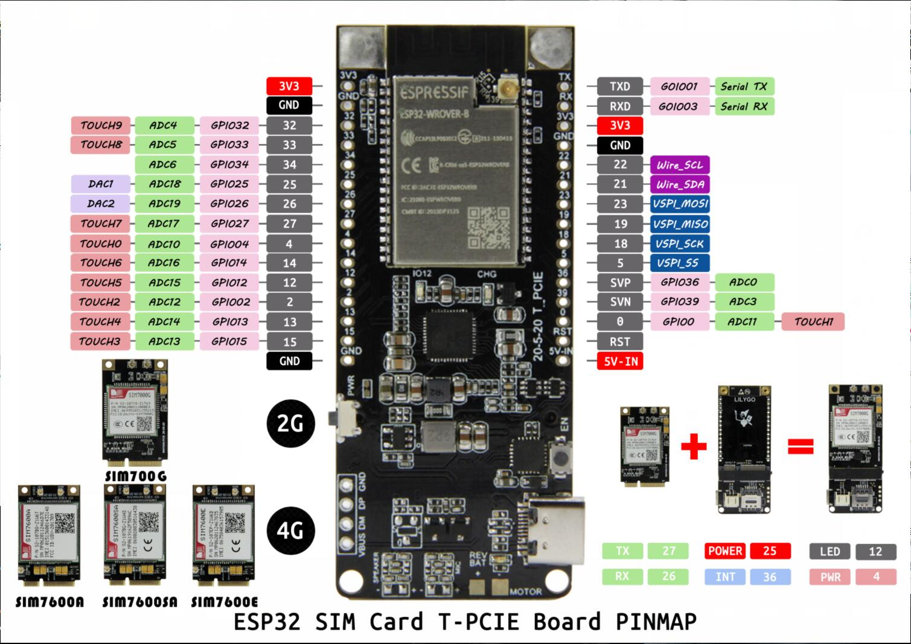
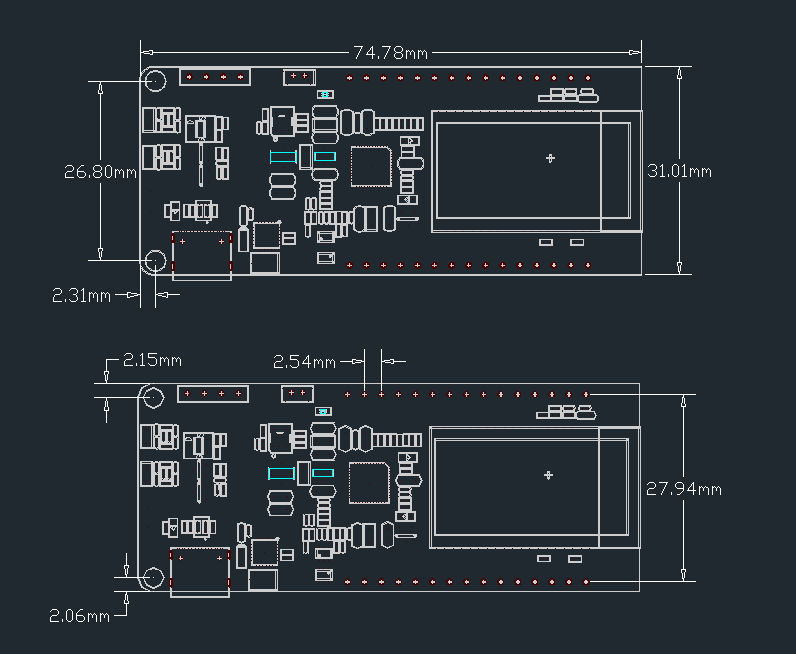
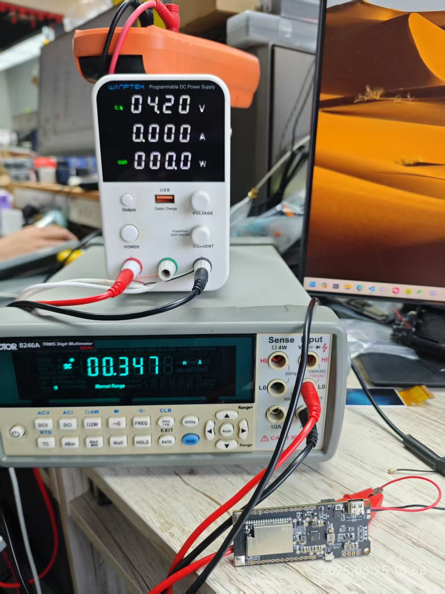

<h1 align = "center">LilyGO T-PCIE</h1>

# News

- A7670 Series Jump here [LilyGO-T-A76XX](https://github.com/Xinyuan-LilyGO/LilyGO-T-A76XX)

<h2 align = "left">Product 📷:</h2>

| Examples |                                                       Product  Link                                                       | Status |
| :------: | :-----------------------------------------------------------------------------------------------------------------------: | :----: |
|  T-PCIE  | [Aliexpress](https://www.aliexpress.com/item/4001142716386.html)   [Amazon](https://www.amazon.com/gp/product/B09JP1HQVX) |   ✅    |

## 1.Steps:
1. Install the current upstream Arduino IDE at the 1.8 level or later. The current version is at the [Arduino website](http://www.arduino.cc/en/main/software).
2. Start Arduino and open Preferences window. In additional board manager add url: https://raw.githubusercontent.com/espressif/arduino-esp32/gh-pages/package_esp32_index.json .separating them with commas.
3. Select Tools -> Board -> ESP32 Dev Module
4. Need to install the following dependencies
     - [TinyGSM](https://github.com/vshymanskyy/TinyGSM)

- [More information](https://cn.simcom.com/product/SIM7600CE.html)

## 2.Pinout

## 3.Dimensions

## 4. How to update firmware?

   [SIM7600SA Upgrade guidelines ](doc/sim7600SA_update_firmware.md)

   [SIM7080 Upgrade guidelines ](doc/sim7080_update_firmware.md)

## 5. Deepsleep current

