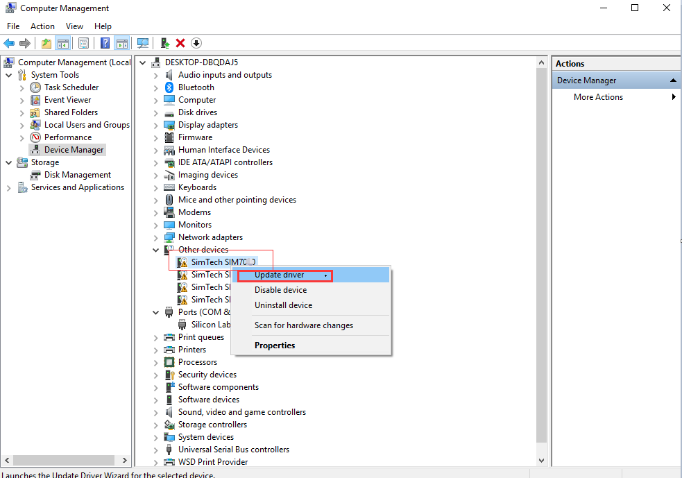
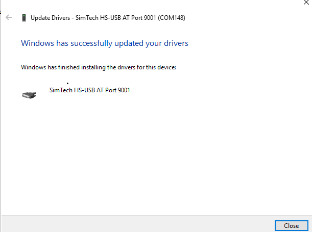
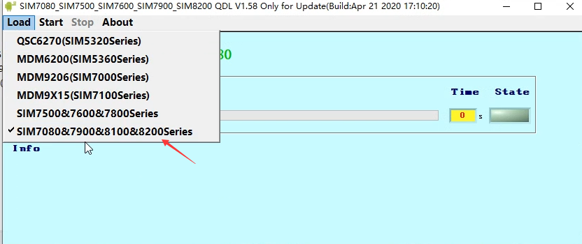
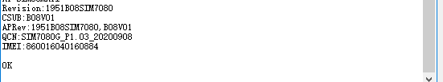

## Quick Step

1. To solder the USB to the upgrade solder joint, you can choose a flying lead or directly solder the USB to the contact. 
2. Power on the SIM7000G board, and at the same time connect the USB interface to the computer port (please note that you need to insert the SIM card during the upgrade process) 
    

3. Download [SIM7000X Driver](../image/update_simxxxx_firmware/USB_driver/), and decompress the corresponding compressed package according to the system you are using. 
4. Open the computer device manager and follow the steps below to add the driver. 
    
    
    
    
    

    Follow the above steps to install the driver for the remaining ports that are not installed.
    

5. Unzip [upgrade_tool](../image/update_simxxxx_firmware/USB_driver/)`SIM7080_SIM7500_SIM7600_SIM7900_SIM8200 QDL V1.58 Only for Update.rar`
6. Open `sim7080_sim7500_sim7600_sim7900_sim8200 qdl v1.58 only for update.exe` 
7.  Open the upgrade tool and follow the diagram below 

    
    
    
    
    
    

8. Open the serial terminal tool, or the built-in serial tool of `Arduino IDE`, select `AT Port` for the port, and enter `AT+CGMR` to view the firmware version 
    

