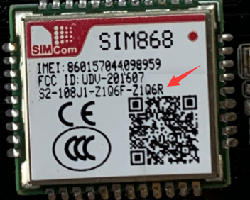

<h1 align = "center">LilyGO T-PCIE</h1>

## Precautions:
1.Due to SIM868 version differences, if version is 6R(as shown below), it should be enabled **#define TINY_GSM_GNSS_BAUD_9600**.Otherwise it should be commented out

